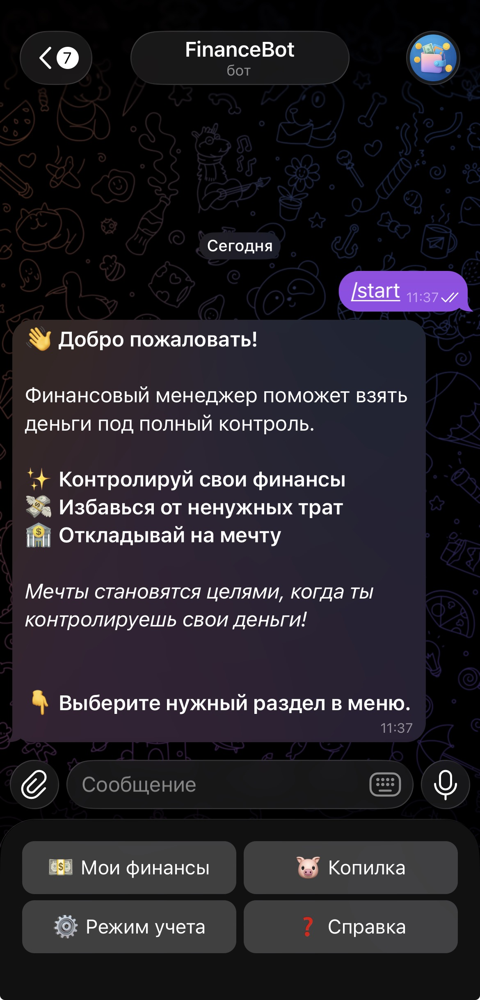
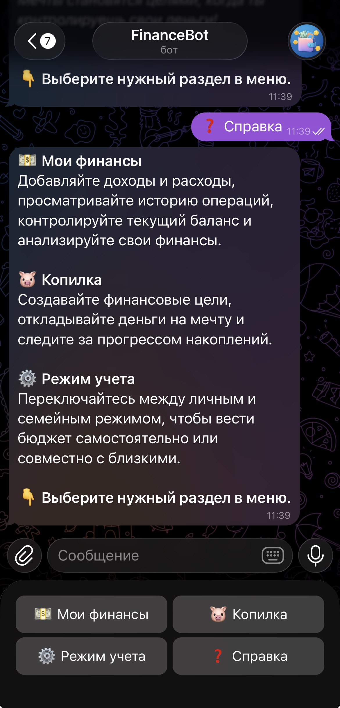
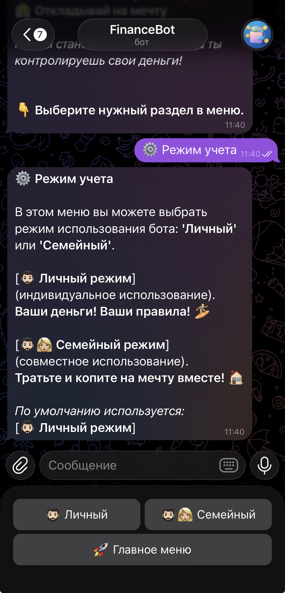
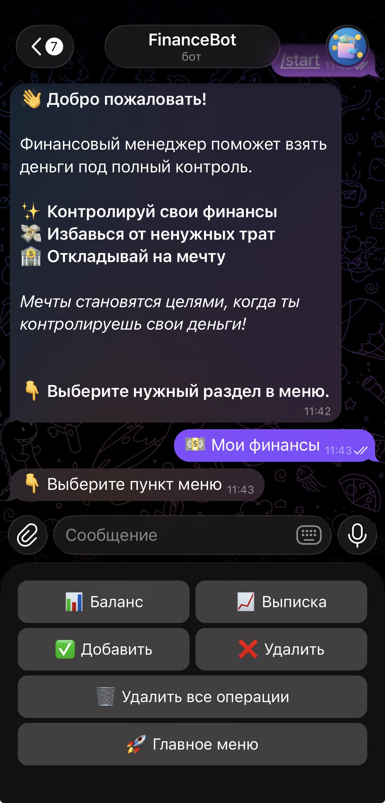

# 💰 Telegram Finance Bot

Простой и удобный Telegram-бот для учета личных финансов.

Проект разработан на Python с использованием **aiogram 3**. Позволяет вести учет доходов и расходов, просматривать баланс и историю операций через интерфейс Telegram.

Проект создавался как учебный, но с упором на правильную архитектуру, читаемый код и возможность дальнейшего расширения функционала.

---

## 🚀 Возможности

✅ Добавление доходов и расходов

✅ Просмотр текущего баланса

✅ Просмотр истории операций

✅ Просмотр отдельно доходов и расходов

✅ Удаление операции по ID

✅ Полное удаление всех операций

✅ Удобная навигация по меню

✅ Хранение данных каждого пользователя отдельно

---

## 📱 Скриншоты

### 🚀 Приветствие и главное меню

<p align="center">
  
</p>

После команды `/start` бот приветствует пользователя и отображает основные разделы.

### ❓ Раздел «Справка»

<p align="center">
  
</p>

Здесь пользователь может быстро узнать назначение каждого раздела.

### ⚙️ Режим учёта

<p align="center">
  
</p>

Здесь можно выбрать 2 режима учета финансов (личный режим и семейный)

⚠️ На данный момент полностью реализован только личный режим.
Семейный режим находится в разработке и будет добавлен в одном из следующих обновлений.

### 💵 Mои финансы

<p align="center">

</p>

Основной раздел для управления своими финансами.

Здесь можно:

- добавлять доходы и расходы;
- просматривать историю операций;
- удалять отдельные операции;
- очищать историю операций;
- просматривать текущий баланс.

Все операции сохраняются автоматически, что позволяет вести удобный учёт личных финансов.

---

## 🛠 Используемые технологии

- Python 3.11
- aiogram 3
- JSON
- FSM (Finite State Machine)
- python-dotenv

---

## 📁 Структура проекта

```
finance_bot/

│
├── bot.py                      # Точка входа
├── handlers.py                 # Обработчики сообщений
├── keyboards.py                # Клавиатуры Telegram
├── utils.py                    # Вспомогательные функции
│
├── manager/
│   ├── logic.py                # Бизнес-логика
│   ├── storage.py              # Работа с хранилищем
│   ├── formatters.py           # Форматирование сообщений
│   ├── constants.py            # Константы проекта
│   └── users/                  # Данные пользователей (не публикуются)
│
├── assets/                     # Дополнительные ресурсы проекта
│   └── images/                 # Скриншоты интерфейса Telegram-бота
│       ├── account-mode.png
│       ├── finance-menu.png
│       ├── help-menu.png
│       └── start-menu.png
│
├── requirements.txt
├── .env.example
├── .gitignore
└── README.md
```

---

## ⚙️ Установка

Клонировать репозиторий

```bash
git clone git@github.com:maksihmm/finance_bot.git
```

Перейти в папку проекта

```bash
cd finance_bot
```

Создать виртуальное окружение

```bash
python -m venv .venv
```

Активировать окружение

Windows

```bash
.venv\Scripts\activate
```

Linux / macOS

```bash
source .venv/bin/activate
```

Установить зависимости

```bash
pip install -r requirements.txt
```

Создайте файл .env на основе .env.example.

```
.env
```

и добавить токен Telegram-бота

```
BOT_TOKEN=your_bot_token
```

Запустить приложение

```bash
python bot.py
```

---

## 📋 Основные команды

| Команда | Описание |
|---------|----------|
| /start | Запуск бота |
| /help | Справка |

Основная работа с ботом выполняется через кнопки меню.

---

## 🗂 Архитектура

Проект разделен на несколько независимых слоев.

```
Telegram

↓

Handlers

↓

Business Logic

↓

Storage

↓

JSON
```

Такая структура позволяет легко заменить способ хранения данных (например, перейти с JSON на SQLite) без изменения обработчиков.

---

## 🔮 План развития

- 👨‍👩‍👧 Семейный режим
- SQLite вместо JSON
- Копилка
- Статистика расходов
- Inline-кнопки для управления операциями
- Развертывание на VPS

---

## 🎯 Цель проекта

Проект создавался для изучения Python, aiogram и принципов построения приложений с разделением логики, хранения данных и пользовательского интерфейса.